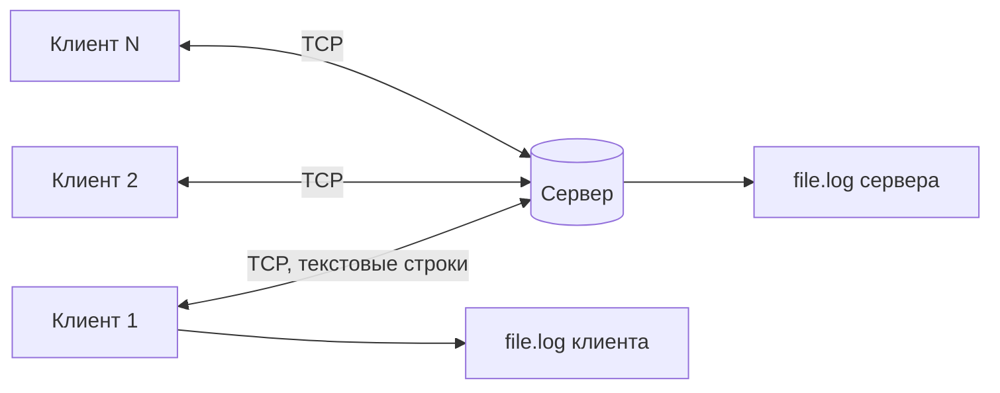

# Сетевой чат

Консольный чат на Java: сервер и клиент общаются по TCP, поддерживается любое число клиентов.

## Схема



## Архитектура

**Сервер** (`ChatServer`)
- поток `accept` — ждёт новые подключения, не блокируя обработку сообщений;
- по одному потоку `ClientHandler` на клиента — читает его сообщения и рассылает остальным;
- потоки создаются через `ExecutorService`; список клиентов — потокобезопасный `Set`;
- все сообщения пишутся в `file.log` с временем (`FileLogger`, метод `synchronized`).

**Клиент** (`ChatClient`)
- главный поток читает консоль и отправляет строки на сервер;
- поток `server-reader` получает сообщения с сервера, печатает в консоль и пишет в `file.log`.

**Протокол** (текст UTF-8, одна строка = одно сообщение)
1. Клиент после подключения отправляет первую строку — своё имя.
2. Далее каждая строка — сообщение чата.
3. `/exit` — клиент выходит из чата.
4. Сервер рассылает остальным клиентам строки вида `имя: текст`, а также служебные `* имя присоединился к чату` / `* имя покинул чат`.

## Настройки

Файл `settings.txt` (лежит рядом с местом запуска или передаётся первым аргументом):

```
host=localhost
port=8080
log=file.log
```

## Сборка и запуск

Требуется JDK 17+ и Maven.

```bash
mvn clean package
```

Запуск сервера (в отдельной папке, чтобы логи не смешивались):

```bash
java -cp target/network-chat-1.0.jar chat.server.ServerMain settings.txt
```

Запуск клиента (в нескольких терминалах):

```bash
java -cp target/network-chat-1.0.jar chat.client.ClientMain settings.txt
```

Выход из клиента — команда `/exit`.

## Проверка через telnet

```
telnet localhost 8080
alice          <- первая строка — имя
hello          <- сообщение
/exit
```

## Тесты

```bash
mvn test
```

Покрыты: чтение настроек, логгер, рассылка сообщений между клиентами, команда `/exit`, подключение в любой момент, запись в лог, клиент.
